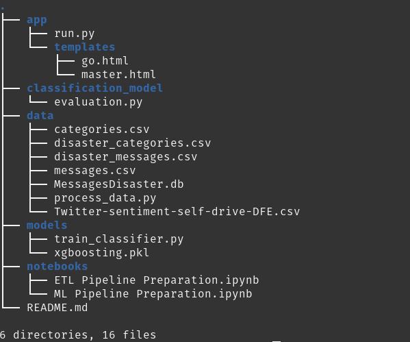
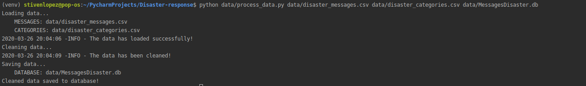
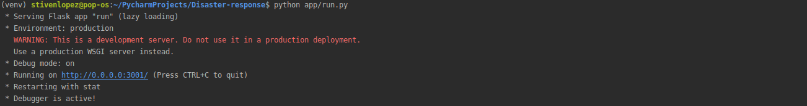

# Disaster Response Pipeline Project

The project has the following structure:

### Instructions:
1. Run the following commands in the project's root directory to set up your database and model.

    - To run ETL pipeline that cleans data and stores in database
        `python data/process_data.py data/disaster_messages.csv data/disaster_categories.csv data/MessagesDisaster.db`
    - To run ML pipeline that trains classifier and saves
        `python models/train_classifier.py data/MessagesDisaster.db models/classifier.pkl`

2. Run the following command in the app's directory to run your web app.
    `python run.py`

3. Go to http://0.0.0.0:3001/

### Solution:

1. Run the following commands in the project's root directory to set up your database and model.

    - Run ETL pipeline that cleans data and stores in database

    - Run ML pipeline that trains classifier and saves

2. Run the following command in the app's directory to run your web app.

3. Go to http://0.0.0.0:3001/