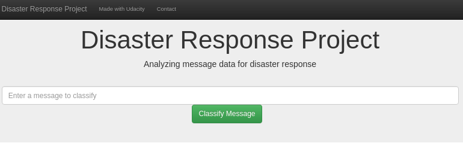

# Disaster Response Pipeline Project

The project has the following structure:

## Motivation

A natural disaster usually entails great loss of life and material, often many are affected by a disaster. Therefore, this project will analyze disaster data [Figure Eight](https://www.figure-eight.com/) to build a model for an API that classifies disaster messages. Something like the above would serve too much to provide adequate and timely help to the different victims, thus satisfying the needs that count at the time.

This project includes a web application, where someone can enter a new message and obtain the classification of this message for various categories. Additionally, the web application shows some visualizations. 

Below are the results of the web application:

It can be seen that the news genre presents a greater number of messages in the database, and additional on average these messages have approximately 31 characters, while genres as direct have messages with an average of 17 characters.

### Instructions:
1. Run the following commands in the project's root directory to set up your database and model.

    - To run ETL pipeline that cleans data and stores in database
        `python data/process_data.py data/disaster_messages.csv data/disaster_categories.csv data/MessagesDisaster.db`
    - To run ML pipeline that trains classifier and saves
        `python models/train_classifier.py data/MessagesDisaster.db models/classifier.pkl`

2. Run the following command in the app's directory to run your web app.
    `python run.py`

3. Go to http://0.0.0.0:3001/

### Solution:

1. Run the following commands in the project's root directory to set up your database and model.

    - Run ETL pipeline that cleans data and stores in database

    - Run ML pipeline that trains classifier and saves

2. Run the following command in the app's directory to run your web app.

3. Go to http://0.0.0.0:3001/

After entering the application, you can write a message and get the prediction, below is a sample:

